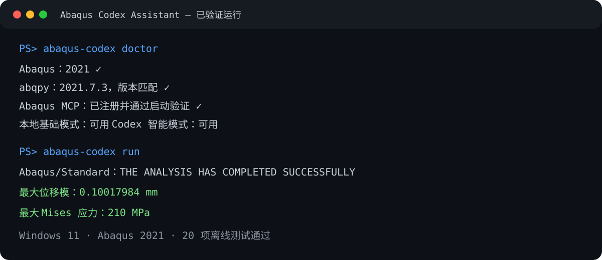

# Abaqus Codex Assistant

一个面向 Abaqus 初学者的开源项目：先检查本机环境，再用清晰、可追溯的步骤完成建模、求解、ODB 结果读取和中文报告生成。

当前已经实现二维矩形板和中心圆孔板拉伸的完整闭环，并在 Abaqus 2021 上完成真实验证。

> 本项目是非官方社区项目，与 Dassault Systèmes 不存在隶属、授权或赞助关系。

## 已实现功能

- 检测 Abaqus 安装位置、版本及自带 Python；
- 检测 `abqpy` 安装状态和版本兼容性；
- 检测 Abaqus MCP 文件、Codex 注册和本地启动状态；
- 在用户明确确认后安装或注册固定版本的 Abaqus MCP；
- 选择入门、论文复现、科研、生产或教学场景；
- 生成二维平面应力矩形板拉伸模型；
- 生成带孔边局部网格细化的二维中心圆孔板拉伸模型；
- 自动运行 Abaqus/Standard；
- 读取 ODB 最后分析帧；
- 输出全模型最大位移模和最大 Mises 应力；
- 生成 UTF-8 中文 Markdown 报告；
- 每次运行使用独立目录，不覆盖历史计算。

## 两种运行模式

| 模式 | 包含功能 | 是否需要 Codex 用量 |
|---|---|---:|
| 本地基础模式 | 环境检测、固定模型、求解、ODB 读取、模板报告 | 否 |
| Codex 智能模式 | 自然语言辅助、脚本修改、错误分析、后续论文复现 | 是 |

项目不会内置或共享公共 API Key。智能模式应由每个用户使用自己的 Codex 登录或 API Key。

## 运行要求

- Windows 10/11；
- 已合法安装并配置许可证的 Abaqus；
- Python 3.10 或更高版本；
- Git；
- 与 Abaqus 大版本匹配的 `abqpy`，例如 Abaqus 2021 使用 `abqpy==2021.*`；
- Codex 和 Abaqus MCP 仅为智能模式所需。

项目不分发 Abaqus，也不绕过许可证。

## 快速开始

以下命令在 PowerShell 的项目根目录运行。以 Abaqus 2021 为例：

```powershell
py -m venv .venv
.\.venv\Scripts\python.exe -m pip install --upgrade pip
.\.venv\Scripts\python.exe -m pip install "abqpy==2021.*"
.\.venv\Scripts\python.exe -m pip install -e .
```

检查环境：

```powershell
.\.venv\Scripts\python.exe -m abaqus_codex doctor
```

如需智能模式，在阅读安全说明后安装或注册 MCP：

```powershell
.\.venv\Scripts\python.exe -m abaqus_codex mcp-setup --yes
```

保存使用场景：

```powershell
.\.venv\Scripts\python.exe -m abaqus_codex configure --scenario learning
```

运行二维矩形板拉伸示例：

```powershell
.\.venv\Scripts\python.exe -m abaqus_codex run
```

运行二维中心圆孔板拉伸示例：

```powershell
.\.venv\Scripts\python.exe -m abaqus_codex run --config .\configs\plate_with_hole_tension.json
```

结果保存在 `outputs/<运行时间>/`：

- `input_config.json`：本次实际使用的参数；
- `results.json`：结构化最大位移和最大 Mises 应力；
- `report.md`：简单中文报告。

Abaqus 的 CAE、ODB、状态和日志文件保存在 `work/runs/<运行时间>/`，默认不提交到 GitHub。

## 示例结果



默认配置采用 mm–MPa 单位制：板长 100 mm、板高 20 mm、厚度 1 mm、弹性模量 210000 MPa、泊松比 0.3、右边位移 0.1 mm。

在 Abaqus 2021 的真实验证结果为：

- 最大位移模：约 0.10017984 mm；
- 最大 Mises 应力：210 MPa；
- `.sta` 状态：`THE ANALYSIS HAS COMPLETED SUCCESSFULLY`。

210 MPa 与线弹性理论值 `E × u / L = 210000 × 0.1 / 100` 一致。

圆孔板默认配置采用板长 100 mm、板高 50 mm、中心孔半径 5 mm、全局网格 2 mm、孔边网格 0.5 mm。在同一台 Abaqus 2021 电脑上的真实验证结果为：

- 最大位移模：约 0.10093824 mm；
- 最大 Mises 应力：约 562.55554 MPa；
- `.sta` 状态：`THE ANALYSIS HAS COMPLETED SUCCESSFULLY`。

圆孔附近存在应力集中，因此最大应力高于无孔板。该数值依赖孔径、板宽和孔边网格，正式使用前必须进行网格收敛性分析，不能把本示例结果直接当作工程许用值。

## 项目结构

```text
abaqus-codex-assistant/
├─ .github/workflows/       GitHub 自动测试
├─ configs/                 示例模型配置
├─ docs/                    快速开始、架构和边界说明
├─ examples/                面向初学者的示例说明
├─ src/abaqus_codex/        主程序与 Abaqus 脚本
├─ tests/                   不需要 Abaqus 的离线测试
├─ work/                    本机计算文件，不提交
└─ outputs/                 本机结果与报告，不提交
```

## 开发与测试

```powershell
$env:PYTHONPATH = (Join-Path (Get-Location) "src")
.\.venv\Scripts\python.exe -m unittest discover -s tests -v
```

GitHub Actions 只运行不依赖 Abaqus 许可证的测试。真实求解必须在已安装 Abaqus 的电脑上运行。

CI 同时覆盖 Linux、Windows、Python 3.10 和 Python 3.13。当前真实 Abaqus 支持范围见 [版本支持表](docs/version-support.md)。

## 维护方式

- 缺陷和功能建议使用仓库内置 Issue 表单；
- 所有改动通过分支和 Pull Request 提交；
- GitHub Actions 自动运行语法检查和 28 项离线测试；
- Dependabot 每月检查 Python 与 GitHub Actions 依赖；
- 版本变化记录在 [CHANGELOG](CHANGELOG.md)；
- 发布前按照 [发布清单](RELEASING.md) 完成真实 Abaqus 验证；
- 支持范围和响应边界见 [SUPPORT](SUPPORT.md)。

## 安全与论文访问

Abaqus MCP 可以执行 Abaqus Python 脚本，属于高权限本地能力。不要让不可信内容直接进入任意脚本执行工具。详细规则见 [SECURITY.md](SECURITY.md)。

论文复现功能第一阶段仅保存场景和合法访问提醒，尚未自动下载论文。项目不得保存机构账号、密码、Cookie、验证码或会话令牌，也不得绕过付费墙。详见 [论文复现边界](docs/paper-reproduction-boundaries.md)。

## 文档

- [快速开始](docs/quick-start.md)
- [首次启动流程](docs/first-run-flow.md)
- [项目架构](docs/architecture.md)
- [版本支持表](docs/version-support.md)
- [日常维护方式](docs/maintenance.md)
- [GitHub 仓库设置](docs/github-settings.md)
- [论文复现边界](docs/paper-reproduction-boundaries.md)
- [贡献指南](CONTRIBUTING.md)
- [变更日志](CHANGELOG.md)
- [支持政策](SUPPORT.md)

## 许可证

本项目使用 [MIT License](LICENSE)。Abaqus 是 Dassault Systèmes 的商业软件，不包含在本项目许可证中。第三方 Abaqus MCP 和 `abqpy` 分别遵循其自身许可证。详见 [第三方与商标声明](NOTICE.md)。
